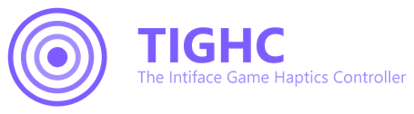

  

# Contributing to TIGHC Profiles

Issues and pull requests are welcome at
[github.com/TIGHC/Profiles](https://github.com/TIGHC/Profiles).

## Adding a new profile

1. Copy an existing folder (`minecraft/` is the most complete example) and
   rename it to a short lowercase id for the new game.
2. Edit `profile.json`: set `name`, `window_titles` to match that game's
   window title, and adjust `bindings` and `vibe` ranges to that game's
   controls. See the [README](README.md) for the full field reference.
3. Validate it loads correctly: point a [TIGHC/Engine](https://github.com/TIGHC/Engine)
   checkout's profiles folder at this repo (or copy the folder in) and run
   `python gui.py` - a structurally invalid profile fails fast with a clear
   error at startup rather than crashing mid-session.
4. Note in your PR description whether the bindings are confirmed against
   the game's actual default keybinds, or inferred/adjusted from a similar
   game - the README's "Included profiles" list tracks this per profile so
   others know what to double-check.

This can also be done interactively from TIGHC's GUI (Profiles tab ->
"New profile...", which starts from a copy of `minecraft/`).

## Editing an existing profile

Same validation step as above - reload it in the GUI or CLI and confirm the
game still behaves as expected before opening a PR. If a game's default
keybinds changed (e.g. after a game update), update `bindings` to match and
say so in the PR.

## Versioning

Bump [`VERSION.md`](VERSION.md) and add a matching entry to
[`CHANGELOG.md`](CHANGELOG.md) in the same PR, following
[Semantic Versioning](https://semver.org/) (`MAJOR.MINOR.PATCH`),
independent of the main Engine's own version. Adding or fixing a profile is
typically a PATCH; adding a new field to the profile format is MINOR.

## Reporting a bug

Open an issue naming the profile/game and what's wrong (wrong keybind,
window title not matching, intensity feels off, etc.).
